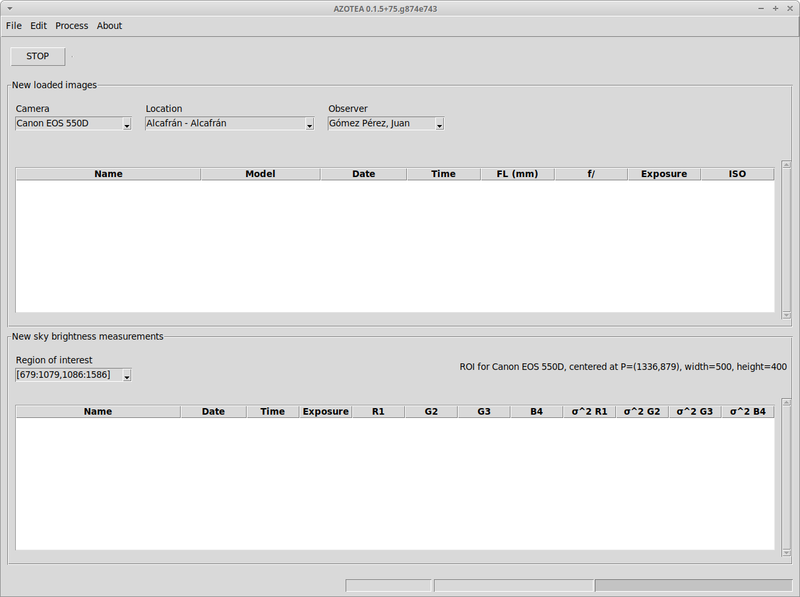
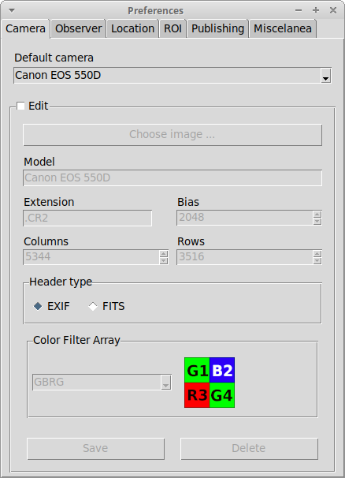
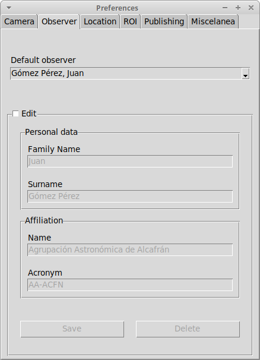
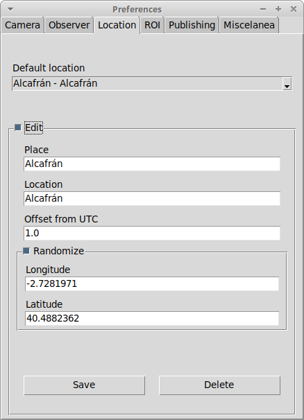
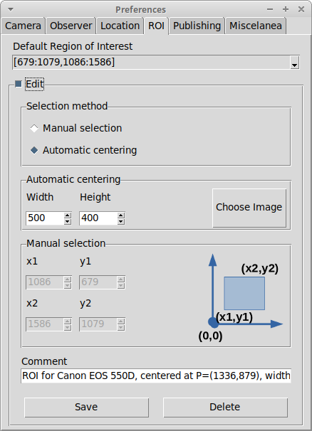
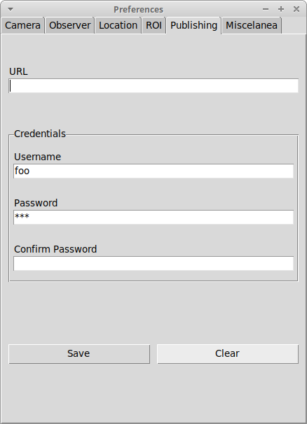

# AZOTEA Client

Sky background image reduction tool for the [AZOTEA project](https://guaix.ucm.es/azoteaproject).
Development of this software has been possible through [ACTION - Participatory science toolkit against pollution](https://actionproject.eu/), Grant 824603.

**Highlights**

* Rich client GUI interactive mode.
* Non interactive command line mode for automated data adquisition, processing and publishing.

# Table of Contents

* [Command line structure](https://github.com/actionprojecteu/azotea-client#command-line-structure)
* [Installation](https://github.com/actionprojecteu/azotea-client#installation)
* [Configuration](https://github.com/actionprojecteu/azotea-client#configuration)
  - [Configuration by command line](https://github.com/actionprojecteu/azotea-client#configuration-by-command-line)
* [Batch mode](https://github.com/actionprojecteu/azotea-client#batch-mode)
  - [Image processing](https://github.com/actionprojecteu/azotea-client#image-processing)
  - [Summaries](https://github.com/actionprojecteu/azotea-client#summaries)
  - [CSV file generation](https://github.com/actionprojecteu/azotea-client#csv-file-generation)
  - [Automation issues](https://github.com/actionprojecteu/azotea-client#automation-issues)
    - [Log file & console output](https://github.com/actionprojecteu/azotea-client#log-file--console-output)
    - [Exit codes](https://github.com/actionprojecteu/azotea-client#exit-codes)
* [FITS Support](https://github.com/actionprojecteu/azotea-client#fits-support)
* [GUI mode](https://github.com/actionprojecteu/azotea-client#configuration)
  - [Launch the program in GUI mode](https://github.com/actionprojecteu/azotea-client#launch-the-program-in-gui-mode)
  - [Image processing in GUI mode](https://github.com/actionprojecteu/azotea-client#image-processing-in-gui-mode)
  - [Screenshots](https://github.com/actionprojecteu/azotea-client#screenshots)


# Command line structure

This package provides two executables: `azotea` and `azotool`. Both have the same structure:

```
azotea  <global options> <command> <subcommand> <subcommand options>
azotool <global options> <command> <subcommand> <subcommand options>
```

where global options are:

* `--version`     Print program version and exit.
* `-h`  `--help`  Show program commands, subcommands and options.
* `-d`, `--dbase` Mandatory database file path.
* `-c`, `--console` Optionally logs to console. Needed for interactive use.
* `-l`, `--log file` Optional log file. Recommended for unattended use.

For a detailed view of all commands, subcommands and specific versions, please use the global `--help` option at every level.

# Installation

This is a Python tool that runs on *only* in Python 3 (tested on Python 3.6) 
It is *highly recommended* to be installed and run in its *own virtual environment*.
This can be easily done in Python 3 with a few lines. See the script below

```bash
#!/bin/bash
AZOTEA_HOME=${HOME}/azotea
python3 -m venv ${AZOTEA_HOME} # (1)
mkdir -p ${AZOTEA_HOME}/images # (2)
mkdir -p ${AZOTEA_HOME}/log    # (2)
mkdir -p ${AZOTEA_HOME}/csv    # (2)
. ${AZOTEA_HOME}/bin/activate  # (3)
pip install -U pip             # (4)
pip install git+https://github.com/actionprojecteu/azotea-client.git@main # (5)
```

* (1) creates a Python virtual environment under `${AZOTEA_HOME}`.
* (2) creates additional subdirectiores under this virtual environment for log files and camera images. Please note that in this example, these directories are placed under `${AZOTEA_HOME}` for convenience, but they can be placed elsewhere.
* (3) activates the virtual environment (**please note the starting dot**) so that all needed python packages are installed there and not system wide.
* (4) updates `pip` (recommended).
* (5) installs the software from [its GitHub repository](https://github.com/actionprojecteu/azotea-client). We download and install the main branch.

There is an error showing `Building wheel for azotea-client (setup.py) ... error` but it seems ok.

Verify it by executing any of these:

```bash
#!/bin/bash
AZOTEA_HOME=${HOME}/azotea

. ${AZOTEA_HOME}/bin/activate

azotool --version
azotea --version
azotool --help
azotea --help
````

# Configuration

The software requires the same configuration whether it is run either in GUI or batch mode:
* Enter observer's data.
* Enter location's data.
* Enter cameras's data.
* Enter Region of Interest data
* Enter miscelaneous data (default optics configuration, publishing credentials)

## Configuration by command line

We'll walk through it using command line tools available for the batch mode, using a ficticious but prototypical example.

*Juan Gómez Pérez* is a Spanish amateur astronomer, member of the *Agrupación Astronómica de Alcafrán* (AA-ACFN), wishing to join the AZOTEA project using his *Cannon EOS 550D* reflex camera. As he uses it for other purposes, the time set in the camera is the local time, not UTC. His observing site is within the small population of Alcafrán *(40.4966031 N, 2.7335649 W)*. As he has an old *50mm f/3.5* objective lens, the camera  doesn't automatically capture this information. He will be measuring sky background in the central rectangular field of view of *500x400 pixels*.

The following series of commands must be issued. This can be edited in a file and run together in a script. For simplicity's sake
error codes are not checked.

```bash
#!/bin/bash
AZOTEA_HOME=${HOME}/azotea                                   # (1)
export PATH=${AZOTEA_HOME}/bin:/usr/local/bin:/usr/bin:/bin
export VIRTUAL_ENV=${AZOTEA_HOME}

DBASE=${AZOTEA_HOME}/azotea.db                              # (2)
IMAGES=${AZOTEA_HOME}/images
LOG=${AZOTEA_HOME}/log/azotea.log
CSV_DIR=${AZOTEA_HOME}/csv

azotool --console --dbase ${DBASE} consent view            # (3)

azotool --console --dbase ${DBASE} observer create --default --name Juan --surname Gómez Pérez \
        --affiliation Agrupación Astronómica de Alcafrán --acronym AA-ACFN  # (4)

azotool --console --dbase ${DBASE} location create --default --randomize --site-name Alcafrán --location Alcafrán \
        --longitude -2.7335649 --latitude 40.4966031 --utc-offset 1  # (5)

azotool --console --dbase ${DBASE} camera create --default \
        --from-image ${IMAGES}/2021-11-22/IMG_0164.CR2   # (6)

azotool --console --dbase ${DBASE} roi create --default --width 500 --height 400 \
        --from-image ${IMAGES}/2021-11-22/IMG_0164.CR2  # (7)

azotool --console --dbase ${DBASE} configure optics --focal-length 50 --f-number 3.5  # (8)

azotool --console --dbase ${DBASE} configure publishing --username foo --password bar
```

1. *Environmental variables*

The first two lines specify environmental variables so that the Python execution is done only within the virtual environment.

2. *Convenience variables*

The `${DBASE}` variable the database file to be created where all the results and associated data are stored.
*It is highly recommended that you always specify such database in your azotea commands*. Otherwise, changing inadveridely from the current working directory a new, empty database file will be created and apparently it seems that you have lost all your data.
Variable `${IMAGES}` point to the root directory where the sofware will find images for data processing. It can be placed as conveniently as you like, although in the example it is pointing  to a directory inside the virtual environment.
Other convenient variables that you may set (not used here) `${LOG}` and `${CSV_DIR}` to specify a log file and the CSV directory where reports are generated.

3. *Consent*

We need your consent to gather some personal data, before you can run the software. 
The software will not run if you do not agree.

4. *Observer data*

We create observer's data specifying his/her name, surmname and affiliation data (with its acronym) 
using the command line options shown.

In addition, we make sure that this is the default observer for the tool, by specifying `--default`. Image processing is always
associated with a default observer.

5. *Location data*

In a similar way, we create a default location, so that observations are associated to this default location. Note that for small locations such as villages, the `--site-name` can be equal to the `--location` name, as in this example. For other cases, they should be different. 
I.e `--site-name Facultad de CC. Físicas UCM --location Madrid` 

In our example, the coorditaes given belong to Juan's personal observatory. As he wishes to preserve hidden the exact location for security reasons, he specifies `--randomize` which will add an uncertainty up to 1 Km.

For public premises such `Facultad de CC. Físicas UCM` this is not usually a concern and thre is no need to specify `--randomize`

Finally the `-utc-offset` specifies a positve +1 offset respect to UTC, as in the rest of the Iberian Peninsula. No Daylight savings time is automatically handled.

6. *Camera data*

We proceed to enter the default camera data. By far the best way is to specify an example RAW file taken from this camera and the software will read all necessary data from it.

7. *Region of interest*

In order to measure the sky background, we must specify a default Region of Interest (ROI). Usually, we wish this ROI to be a rectangle centered around the image centre. The best way to do it is, once more, specify the rectangle width and height and an image
so that the software computes the actual rectangle corners.

8. *Miscelaneous*

Last, we must specify defaults optics data (focal length in mm and f/ number) just in case there is no such data available in the image EXIF headers. Also the credentials can be specified so that the results are automatically uploaded to our server. (**NOTE: This is not yet available**)


An instance of the console output can be seen below:

```
UNIVERSIDAD COMPLUTENSE DE MADRID
=================================

By using this software you explicitely give 
Universidad Complutense de Madrid consent to gather:
* your name and surname.
* your affiliation (i.e. amateur club name or institution).
* your observatory approximate location.

These data will be kept in a file whose owner is 
Universidad Complutense de Madrid and will not be used for other
purpose than to give credit to the participants' observations. 
You can rectify or ask to delete your data 
by writting at the following address: ainhoasa@ucm.es

Press the 'y' key then <ENTER> to agree, any other key to disagree.

y
------------------
Agreement accepted
------------------
2021-11-24T09:54:18+0100 [dbase#info] Starting Database Service on /home/jgomez/azotea/azotea.db
2021-11-24T09:54:18+0100 [dbase#info] Database version = 01
2021-11-24T09:54:18+0100 [cli#info] Versioned insert observer: {'family_name': 'Juan', 'surname': 'Gómez Pérez', 'affiliation': 'Agrupación Astronómica de Alcafrán', 'acronym': 'AA-ACFN'}
2021-11-24T09:54:18+0100 [cli#info] Setting default observer configuration as = {'observer_id': 1}
2021-11-24T09:54:18+0100 [dbase#info] Stopping Database Service
2021-11-24T09:54:18+0100 [-] Main loop terminated.
2021-11-24T09:54:19+0100 [dbase#info] Starting Database Service on /home/jgomez/azotea/azotea.db
2021-11-24T09:54:19+0100 [dbase#info] Database version = 01
2021-11-24T09:54:19+0100 [cli#info] Randomized coordinates (-2.7335649, 40.4966031) -> (-2.7350233, 40.4950856)
2021-11-24T09:54:19+0100 [cli#info] Insert to location: {'site_name': 'Alcafrán', 'location': 'Alcafrán', 'longitude': -2.7350233, 'latitude': 40.4950856, 'randomized': 1, 'utc_offset': 1}
2021-11-24T09:54:19+0100 [cli#info] Setting default location configuration as = {'location_id': 1}
2021-11-24T09:54:19+0100 [dbase#info] Stopping Database Service
2021-11-24T09:54:19+0100 [-] Main loop terminated.
2021-11-24T09:54:19+0100 [dbase#info] Starting Database Service on /home/jgomez/azotea/azotea.db
2021-11-24T09:54:19+0100 [dbase#info] Database version = 01
2021-11-24T09:54:20+0100 [CTRL #info] analyzing bias levels([2049, 2049, 2050, 2049])
2021-11-24T09:54:20+0100 [CTRL #info] global bias set to = 2048
2021-11-24T09:54:20+0100 [cli#info] Insert/replace camera data: {'model': 'Canon EOS 550D', 'extension': '.CR2', 'bias': 2048, 'width': 5344, 'length': 3516, 'header_type': 'EXIF', 'bayer_pattern': 'GBRG'}
2021-11-24T09:54:20+0100 [cli#info] Setting default camera configuration as = {'camera_id': 4}
2021-11-24T09:54:20+0100 [dbase#info] Stopping Database Service
2021-11-24T09:54:20+0100 [-] Main loop terminated.
2021-11-24T09:54:20+0100 [dbase#info] Starting Database Service on /home/jgomez/azotea/azotea.db
2021-11-24T09:54:20+0100 [dbase#info] Database version = 01
2021-11-24T09:54:21+0100 [cli#info] Insert/replace ROI: {'x1': 1086, 'y1': 679, 'x2': 1586, 'y2': 1079, 'display_name': '[679:1079,1086:1586]', 'comment': 'ROI for Canon EOS 550D, centered at P=(1336,879), width=500, height=400'}
2021-11-24T09:54:21+0100 [cli#info] Setting default ROI configuration as = {'roi_id': 1}
2021-11-24T09:54:22+0100 [dbase#info] Stopping Database Service
2021-11-24T09:54:22+0100 [-] Main loop terminated.
2021-11-24T09:54:22+0100 [dbase#info] Starting Database Service on /home/jgomez/azotea/azotea.db
2021-11-24T09:54:22+0100 [dbase#info] Database version = 01
2021-11-24T09:54:22+0100 [cli#info] Writting default optics configuration = {'focal_length': 180, 'f_number': '3.5'}
2021-11-24T09:54:22+0100 [dbase#info] Stopping Database Service
2021-11-24T09:54:22+0100 [-] Main loop terminated.
2021-11-24T09:54:22+0100 [dbase#info] Starting Database Service on /home/jgomez/azotea/azotea.db
2021-11-24T09:54:22+0100 [dbase#info] Database version = 01
2021-11-24T09:54:22+0100 [cli#info] Writting publishing configuration = {'username': 'foo', 'password': 'bar'}
2021-11-24T09:54:22+0100 [dbase#info] Stopping Database Service
2021-11-24T09:54:22+0100 [-] Main loop terminated.
```

# Batch mode

## Image processing

In batch mode, loading images, peforming sky brightness measurements and (optionally) publishing results can be done all at once:

```bash
#!/bin/bash
AZOTEA_HOME=${HOME}/azotea
export PATH=${AZOTEA_HOME}/bin:/usr/local/bin:/usr/bin:/bin
export VIRTUAL_ENV=${AZOTEA_HOME}

DBASE=${AZOTEA_HOME}/azotea.db
LOG=${AZOTEA_HOME}/log/azotea.log
IMAGES=${AZOTEA_HOME}/images

azotea --dbase ${DBASE} --log-file ${LOG} batch --images-dir ${IMAGES} --publish 
```

The `--images-dir` option specifies an images base directory. 
It will recursively traverse all subdirectories and load images matching the extension 
specified by the default camera i.e. `(*.CR2)`.
You can also specify a maximun subdirectory scanning depth using the optional `--depth <n>` flag. 
A depth = 0 scans and load images only in the given `--images-dir` directory.

We recommend organizing your images following a scheme like `YYYY-MM-DD` for the subdirectories.
Directoris will be processed with descendent order, that is, from the 
most recent name (i.e. 2021-11-02) to the least recent one. 
This allows the most recent images to be processed first.

```
${AZOTEA_HOME}/images
                |
                +----/2021-05-07
                |
                +----/2021-05-08
                (...)
                +----/2021-11-02
```
## Summaries

After the processing is done, you can see a processing summary by issuing `azotool image summary`: 

```
2021-11-25T10:55:21+0100 [dbase#info] Starting Database Service on /home/jgomez/azotea/azotea.db
2021-11-25T10:55:21+0100 [dbase#info] Database version = 01
2021-11-25T10:55:21+0100 [cli#info] 
  +-------------------+------------+
  | Observer          |   # Images |
  +===================+============+
  | Gómez Pérez, Juan |        125 |
  +-------------------+------------+
2021-11-25T10:55:21+0100 [dbase#info] Stopping Database Service
2021-11-25T10:55:21+0100 [-] Main loop terminated.
```

or `azotool sky summary`

```
2021-11-25T10:55:21+0100 [dbase#info] Starting Database Service on /home/jgomez/azotea/azotea.db
2021-11-25T10:55:21+0100 [dbase#info] Database version = 01
2021-11-25T10:55:21+0100 [cli#info] 
  +-------------------+----------------------+------------+
  | Observer          | ROI                  |   # Images |
  +===================+======================+============+
  | Gómez Pérez, Juan | [679:1079,1086:1586] |        125 |
  +-------------------+----------------------+------------+
2021-11-25T10:55:21+0100 [dbase#info] Stopping Database Service
2021-11-25T10:55:21+0100 [-] Main loop terminated.
```


## CSV File generation

CSV file generation in batch mode is done by using `azotool`. It has the 
same options as in the GUI mode. We can use the `--console` option 
if executed interactively or the `--log-file` option if executed within 
an automation script. See the script below for export options.

```bash
#!/bin/bash
AZOTEA_HOME=${HOME}/azotea
export PATH=${AZOTEA_HOME}/bin:/usr/local/bin:/usr/bin:/bin
export VIRTUAL_ENV=${AZOTEA_HOME}

DBASE=${AZOTEA_HOME}/azotea.db
LOG=${AZOTEA_HOME}/log/azotea.log
CSV_DIR=${AZOTEA_HOME}/csv

azotool --dbase ${DBASE} --console --log-file ${LOG} sky export --csv-dir ${CSV_DIR} --all
azotool --dbase ${DBASE} --console --log-file ${LOG} sky export --csv-dir ${CSV_DIR} --latest-night
azotool --dbase ${DBASE} --console --log-file ${LOG} sky export --csv-dir ${CSV_DIR} --latest-month
azotool --dbase ${DBASE} --console --log-file ${LOG} sky export --csv-dir ${CSV_DIR} --unpublished
azotool --dbase ${DBASE} --console --log-file ${LOG} sky export --csv-dir ${CSV_DIR} --range --from-date 2021-01-21 --to-date 2021-03-18
```

## Automation issues

### Log file & console output

It is highly recommeded to configure a log file when executing azotea in batch mode. 
This log file is not rotated, so you should use an external log rotation tool like `logrotate` 
and set its rotation policy as needed. For the same reason, console output is not activated 
by default and must be explicitely activated with `--console`, Redirecting console `stdout` `stderr` 
has the same effect as specifying a log file but it is a bit more cumbersome.

You can configure the console/log file verbosity of the main three long running processes:
* image loading into database
* sky background computation
* publishing results to a server

The default log level is `info`

See the `azotool configure logging  --help`

```
usage: azotool configure logging [-h] [--load {critical,error,warn,info,debug}] [--sky {critical,error,warn,info,debug}] [--publish {critical,error,warn,info,debug}]

optional arguments:
  -h, --help            show this help message and exit
  --load {critical,error,warn,info,debug}
                        Image loading log level
  --sky {critical,error,warn,info,debug}
                        Sky processing log level
  --publish {critical,error,warn,info,debug}
                        publishing log level
````

### Exit codes

Both `azotool` and `azotea` commands return the following exit codes are:

* 0 => Command finished without errors.
* 1 => Command finished with errors. See the console (if set) or the log file.
* 126 => User did not agree the usage conditions.

# FITS Support

AZOTEA now supports reading and computing statistics from RAW images taken from astrocameras which
write their output in FITS format. A previous FITS keywords pre-processing is needed, so that AZOTEA
can smoothly read metadata without having to deal with FITS software idiosyncrasies.

Detailed information on this pre-porcessing step can be found in the [AZOFITS documentation](https://github.com/actionprojecteu/azotea-client/blob/main/FITS.md).

AZOTOOL software must *always* be used before issuing commands to AZOTEA.
Once image are pre-procesed, camera and ROI creation can be even made from FITS images, 
as shown in the example below.

```bash
# Edit FITS headers with AZOFITS
azofits --console --images-dir ${IMAGES}/202201 --swcreator captura-fits --camera ZWO ASI178MC --bayer-pattern RGGB --gain 150 --bias 64 --diameter 10 --focal-length 35

# Input metadata with AZOTOOL
# Assume taht observer & location metadata has already been input
azotool --console --dbase ${DBASE} camera create --default \
        --from-image ${IMAGES}/202201/20220101-183017.10000.fits

azotool --console --dbase ${DBASE} roi create --default --width 500 --height 400 \
        --from-image ${IMAGES}/202201/20220101-183017.10000.fits

# Load images in AZOTEA database and compute statistics
azotea --console --dbase ${DBASE} --images-dir ${IMAGES}/202201
```


# GUI Mode

Azotea in GUI mode offers the same functions as the command line version. 
See the attached screeshots below.

## Launch the program in GUI mode

You can use this script to launch AZOTEA in GUI mode

```bash
#!/bin/bash
AZOTEA_HOME=${HOME}/azotea
export PATH=${AZOTEA_HOME}/bin:/usr/local/bin:/usr/bin:/bin
export VIRTUAL_ENV=${AZOTEA_HOME}

DBASE=${AZOTEA_HOME}/azotea.db
LOG=${AZOTEA_HOME}/log/azotea.log

azotea --dbase ${DBASE} --log-file ${LOG} gui
```
## Image processing in GUI mode

In GUI Mode, there are two steps:
1. `File > Load images ...`
2. `Process > Sky Brightness ...`

Then we can either generate a CSV file with the results or publsih them:
* `File > Export to CSV ...`
* `File > Publish Measurements ...`

## Screenshots














